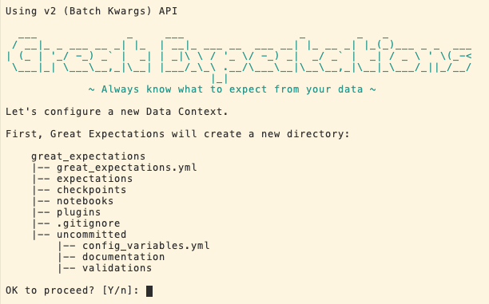
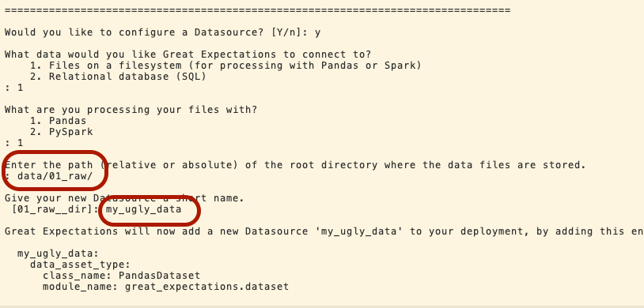

[](https://gitpod.io/#https://github.com/SDK/kedro_ge)

# Data Quality lab              

## Intro

Este lab esta diseñado para servir como metodo de aprendizaje de Kedro + Great expectations

Contiene 2 datasets
* Iris data
* Netflix Tittles


## Iniciar Catalogo de GE 

Inicializemos el ambiente con 

```
great_expectations init
```



Luego debemos confirmar el tipo de dataset, path y nombre que queremos darle.



Confirmemos para hacer el profiling:
```
================================================================================

Would you like to profile new Expectations for a single data asset within your new Datasource? [Y/n]: y

Would you like to:
    1. choose from a list of data assets in this datasource
    2. enter the path of a data file
: 1

Which data would you like to use?
    1. iris (file)
    2. netflix_titles (file)
    Don't see the name of the data asset in the list above? Just type it
: 1

Name the new Expectation Suite [iris.warning]: 

Great Expectations will choose a couple of columns and generate expectations about them
to demonstrate some examples of assertions you can make about your data.

Great Expectations will store these expectations in a new Expectation Suite 'iris.warning' here:

  file:///workspace/kedro_ge/great_expectations/expectations/iris/warning.json

Would you like to proceed? [Y/n]: 

Generating example Expectation Suite...

Done generating example Expectation Suite

================================================================================

Would you like to build Data Docs? [Y/n]: 

The following Data Docs sites will be built:

 - local_site: file:///workspace/kedro_ge/great_expectations/uncommitted/data_docs/local_site/index.html

Would you like to proceed? [Y/n]: 

Building Data Docs...

Done building Data Docs

Would you like to view your new Expectations in Data Docs? This will open a new browser window. [Y/n]: 
```

## Agregar Datasource a GE 

para agregar un nuevo dataset basta que corramos:
```
great_expectations datasource new
```
y volveremos a pasar por el menu para agregar un dataset.

## Realizar un nuevo profile
```
great_expetations datasource profile <my_dataset>
```

## Basic commands:


https://docs.greatexpectations.io/en/latest/reference/glossary_of_expectations.html


```
kedro jupyter notebook --NotebookApp.allow_origin=\'$(gp url 88
88)\'

```